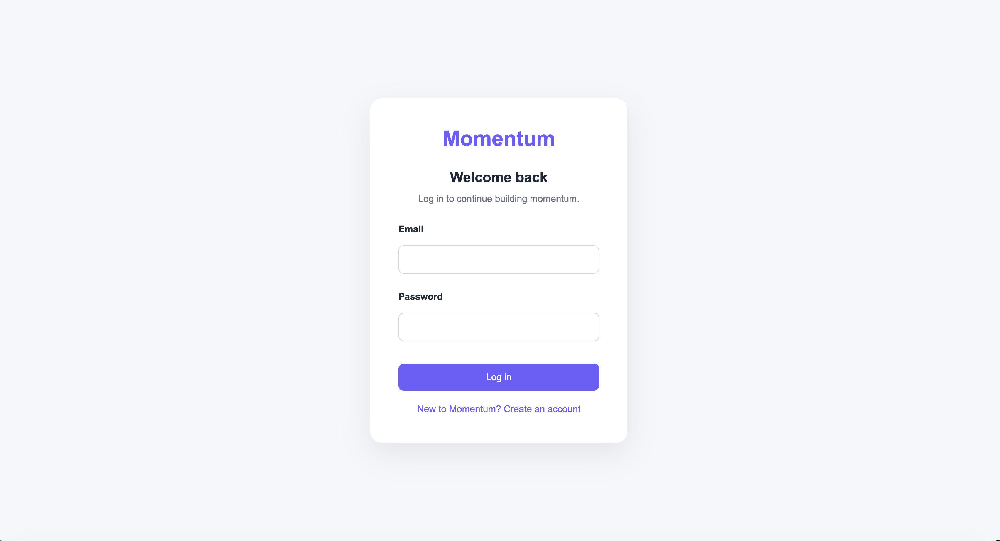
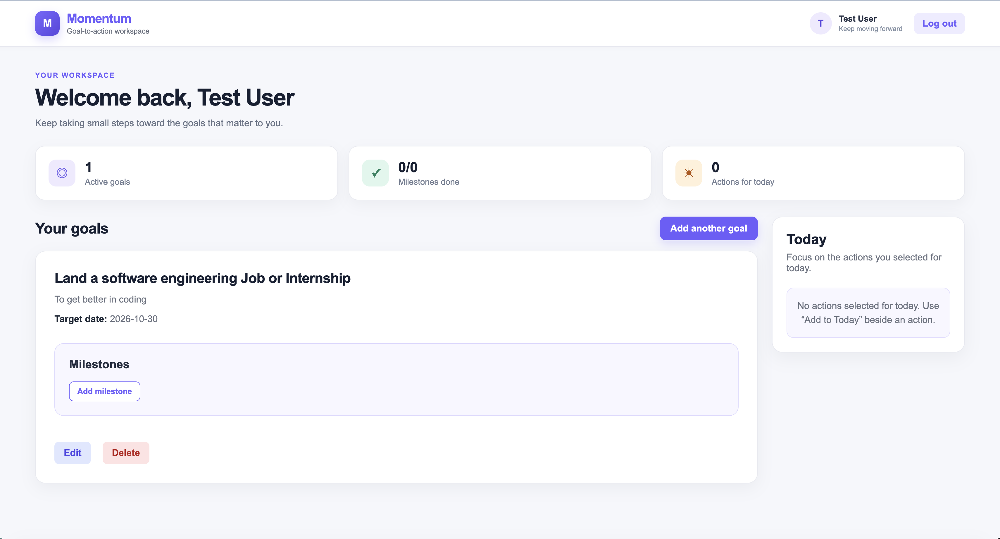
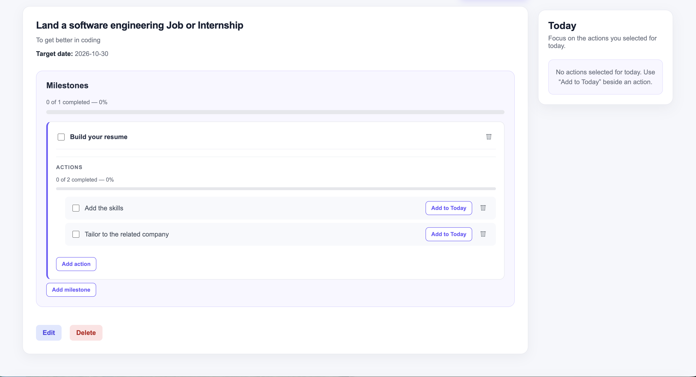

# Momentum

Momentum is a full-stack productivity application that helps users transform long-term goals into milestones and manageable daily actions.

Users can organize their goals, track their progress, and choose important actions to focus on today.

## Live Application

[Open the live Momentum application](https://momentum-goal-system-1.onrender.com)

> Momentum is hosted using Render’s free plan, so the server may take a short moment to start after being inactive.

## Screenshots

### Login



### Dashboard



### Goal, Milestones, and Actions



## Features

- Create an account and log in securely
- Keep each user’s data private
- Create, edit, and delete goals
- Set descriptions and target dates
- Divide goals into milestones
- Add smaller actions to milestones
- Mark milestones and actions as completed
- Add important actions to the Today dashboard
- View goal and action progress
- Receive confirmation before deleting data
- Keep data stored in a PostgreSQL database
- Use the application on desktop and mobile screens

## Technologies Used

### Frontend

- React
- JavaScript
- Vite
- HTML
- CSS
- Fetch API

### Backend

- Node.js
- Express.js
- PostgreSQL
- JSON Web Tokens
- bcrypt
- HTTP-only authentication cookies
- REST API

### Database and Deployment

- Neon PostgreSQL
- Render
- GitHub

## Project Structure

```text
momentum-goal-system/
├── client/
│   └── src/
│       ├── components/
│       │   ├── AuthForm.jsx
│       │   ├── DashboardSummary.jsx
│       │   ├── GoalCard.jsx
│       │   ├── MilestoneItem.jsx
│       │   └── TodayDashboard.jsx
│       ├── App.jsx
│       ├── App.css
│       ├── index.css
│       └── main.jsx
├── server/
│   ├── index.js
│   ├── schema.sql
│   └── package.json
└── README.md
```

## How Momentum Works

1. The user creates an account or logs in.
2. The user creates a long-term goal and selects a target date.
3. The goal is divided into milestones.
4. Each milestone is divided into smaller actions.
5. Actions can be completed or added to the Today dashboard.
6. Progress updates as the user completes milestones and actions.

## Running the Project Locally

### 1. Clone the repository

```bash
git clone https://github.com/humairakarimi/momentum-goal-system.git
cd momentum-goal-system
```

### 2. Configure and run the backend

Open the server folder:

```bash
cd server
npm install
```

Create a `.env` file inside the `server` folder:

```env
DATABASE_URL_POOLED=your_postgresql_connection_string
JWT_SECRET=your_secret_key
CLIENT_URL=http://localhost:5173
NODE_ENV=development
```

Start the server:

```bash
npm run dev
```

The backend should run at:

```text
http://localhost:5001
```

### 3. Configure and run the frontend

Open another terminal and navigate to the client folder:

```bash
cd client
npm install
```

Create a `.env` file inside the `client` folder:

```env
VITE_API_URL=http://localhost:5001
```

Start the React development server:

```bash
npm run dev
```

Open the address displayed by Vite, normally:

```text
http://localhost:5173
```

## API Overview

The Express backend provides REST API endpoints for:

- User registration
- User login and logout
- Authentication checks
- Goal management
- Milestone management
- Action management
- Today-dashboard actions

Protected endpoints require an authenticated user session.

## What I Learned

Building Momentum helped me gain practical experience with:

- Structuring a React application with reusable components
- Managing application state with React hooks
- Building controlled forms
- Connecting a React frontend to an Express backend
- Designing and consuming REST API endpoints
- Creating relational PostgreSQL database tables
- Implementing authentication and authorization
- Protecting user-specific data
- Managing environment variables securely
- Debugging frontend, backend, and database integration
- Deploying a full-stack application

## Future Improvements

- Goal categories and filtering
- Due-date reminders
- Password reset functionality
- User profile settings
- Additional dashboard analytics
- Automated frontend and backend tests
- Further accessibility improvements

## Author

**Humaira Karimi**

- [GitHub](https://github.com/humairakarimi)
